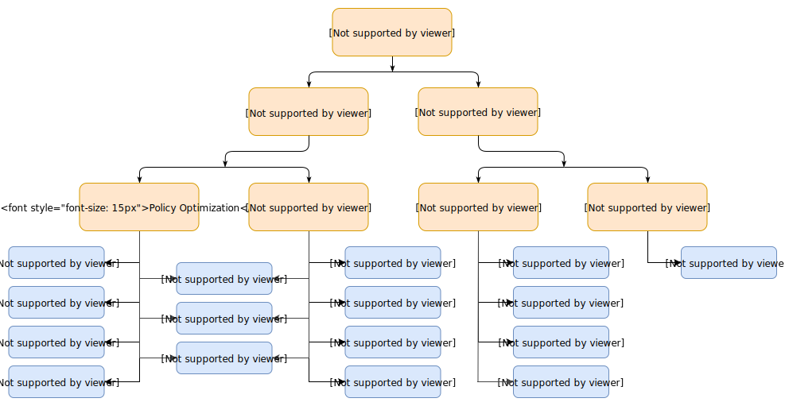

# Introduction to Reinforcement Learning

This repository is a hands-on learning project for core Reinforcement Learning (RL) ideas through three practical demos:

- Tabular Q-learning on FrozenLake
- REINFORCE (policy gradient) on CartPole
- PPO on CartPole using Stable-Baselines3

It is designed to connect theory and implementation: you can read concepts, run training, evaluate policies, and generate demo videos.

## What this repo includes

- `demos/q_learning_frozenlake.py`: value-based, model-free RL with a Q-table
- `demos/reinforce_cartpole.py`: direct policy optimization with Monte Carlo returns
- `demos/gymnasium_ppo_cartpole.py`: practical PPO workflow with `stable-baselines3`
- `docs/rl_explanations.md`: full code-referenced theory walkthrough (EN)
- `docs/rl_explanations.es.md`: full code-referenced theory walkthrough (ES)
- `videos/`: recorded evaluation runs
- `models/`: saved model artifacts (for PPO)

## RL concepts covered (from `docs/rl_explanations.md`)

### Foundations

- Agent, environment, state, action, reward, policy
- Objective: maximize expected discounted return
- Model-based vs model-free RL, and why this repo focuses on model-free methods
.

### Q-learning summary

Q-learning learns action values $Q(s,a)$ and derives a policy with `argmax`.

Update rule used by the demo:

$$
Q(s,a) \leftarrow Q(s,a) + \alpha \left[r + \gamma \max_{a'}Q(s',a') - Q(s,a)\right]
$$

Implemented concepts in the script:

- Epsilon-greedy exploration with epsilon decay
- Bellman/TD update
- Terminal handling (no bootstrap on terminal state)
- Greedy post-training evaluation (success rate)

### REINFORCE summary

REINFORCE optimizes a stochastic policy $\pi_\theta(a|s)$ directly.

Training loss used conceptually:

$$
\mathcal{L}(\theta) = -\sum_t \log \pi_\theta(a_t|s_t) G_t
$$

Implemented concepts in the script:

- Sampling actions from a policy network
- Discounted return computation
- Return normalization for lower-variance updates
- Episode-level policy gradient optimization

### PPO summary

PPO is a stable policy optimization method implemented here via `stable-baselines3`.

Implemented workflow in the demo:

- Create and train PPO agent (`MlpPolicy`) on CartPole
- Save model under `models/`
- Evaluate deterministic policy performance
- Optional human rendering and optional video recording

### Model vs policy vs value function

- **Model**: predicts environment dynamics/rewards
- **Policy**: chooses actions from states
- **Value function**: estimates expected return

In this repo:

- Q-learning primarily learns a value function (`Q-table`)
- REINFORCE/PPO primarily optimize policies (PPO also estimates value internally)

## Quick start

### Prerequisites

- Python 3.10 or 3.11
- `uv` installed

### Install dependencies

From project root:

```powershell
uv pip install -r requirements.txt
```

## Run the demos

### 1) Q-learning (FrozenLake)

```powershell
python demos/q_learning_frozenlake.py
```

Useful options:

```powershell
python demos/q_learning_frozenlake.py --slippery
python demos/q_learning_frozenlake.py --render-eval --render-episodes 5
python demos/q_learning_frozenlake.py --record-video --video-episodes 5 --video-dir videos/q_learning_frozenlake
python demos/q_learning_frozenlake.py --record-and-render --render-episodes 5 --video-episodes 5
```

### 2) REINFORCE (CartPole)

```powershell
python demos/reinforce_cartpole.py
```

Useful options:

```powershell
python demos/reinforce_cartpole.py --episodes 1500 --lr 0.0005 --gamma 0.99
python demos/reinforce_cartpole.py --render-eval --render-episodes 3
python demos/reinforce_cartpole.py --record-video --video-episodes 3 --video-dir videos/reinforce_cartpole
python demos/reinforce_cartpole.py --record-and-render --render-episodes 3 --video-episodes 3
```

### 3) PPO (CartPole)

```powershell
python demos/gymnasium_ppo_cartpole.py
```

Useful options:

```powershell
python demos/gymnasium_ppo_cartpole.py --render-demo
python demos/gymnasium_ppo_cartpole.py --render-eval --render-episodes 3
python demos/gymnasium_ppo_cartpole.py --record-video --video-episodes 3 --video-dir videos/ppo_cartpole
python demos/gymnasium_ppo_cartpole.py --record-and-render --render-episodes 3 --video-episodes 3
```

## Suggested learning / teaching order (about 60 minutes)

1. RL foundations + model-free context
2. Q-learning demo and Bellman updates
3. REINFORCE demo and policy gradient intuition
4. PPO demo as a practical modern baseline
5. Wrap-up: model vs policy vs value function

For the full code-referenced explanation, see `docs/rl_explanations.md`.
